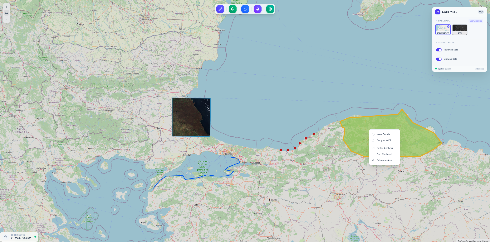

# Geo ETL Engine

A web application for converting and visualizing GIS data.


## Features
- Import GIS files: KML, Shapefile (ZIP), GeoJSON, GPX, WKT
- Export data as GeoJSON, KML, or Shapefile
- View data on an interactive map
- Draw points, lines, polygons
- Print the map as PDF or PNG

## Tech Stack
- Angular 21 (Standalone Components, Signals)
- Openlayers
- Other libraries: shpjs, @mapbox/togeojson
- Tailwind CSS

## How It Works
1. **Upload**: User uploads a GIS file
2. **Convert**: Service layer detects format and converts to GeoJSON
3. **State**: Data is stored in a signal
4. **View**: Map updates automatically
5. **Export**: Download current data as GeoJSON

## Getting Started
1. Install dependencies:
	```bash
	npm install
	```
2. Start the app:
	```bash
	npm start
	```
3. Open [http://localhost:4200](http://localhost:4200)

## Project Structure
- `src/app/components/` - UI components (map, upload, download, etc.)
- `src/app/services/` - Data and map services
- `src/app/import-export/` - Format strategies
- `src/app/helpers/` 
- `src/app/models/` 
- `src/app/utils/` 
- `public/data/` - Sample GIS files

## License
MIT
